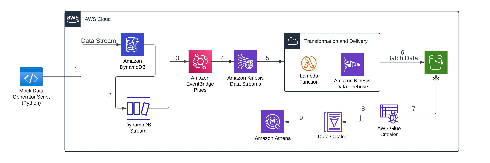

# End-to-End Real-Time Data Pipeline for Sales Streaming and Transformation with AWS

## Project Overview
This project demonstrates a complete real-time data pipeline for ingesting, transforming, and storing real-time sales data using AWS services. The pipeline begins with a Python script that generates real-time sales data, which is ingested into Amazon DynamoDB. The CDC (Change Data Capture) events from DynamoDB are captured by DynamoDB Streams and routed to Amazon Kinesis Data Streams via Amazon EventBridge Pipes.
Amazon Kinesis Data Firehose is then used to batch the data and deliver it to Amazon S3 after transformation with AWS Lambda. Finally, AWS Glue Crawler discovers the schema of the stored data, and Amazon Athena allows users to query and analyze the data.

## Tech Stack
- **Amazon DynamoDB**: Ingests real-time sales data.
- **Amazon DynamoDB Streams**: Captures CDC (Change Data Capture) events from DynamoDB.
- **Amazon EventBridge Pipes**: Streams data from DynamoDB Streams to Amazon Kinesis.
- **Amazon Kinesis Data Streams**: Processes real-time data from DynamoDB Streams.
- **Amazon Kinesis Data Firehose**: Collects data in batches for near real-time delivery.
- **AWS Lambda**: Transforms data within Firehose before ingestion into Amazon S3.
- **Amazon S3**: Stores the batched data for long-term storage.
- **AWS Glue Crawler**: Discovers and catalogs the schema of the data in S3.
- **Amazon Athena**: Queries and analyzes the data stored in S3.

---

## Architecture Diagram

---

## Project Workflow

### 1. Real-Time Sales Data Generation and Ingestion into DynamoDB
- A Python script generates real-time sales data and inserts it into an **Amazon DynamoDB** table.
- **Amazon DynamoDB** acts as the initial data store, capturing real-time sales data from the script.

### 2. Capturing CDC Events with DynamoDB Streams
- **Amazon DynamoDB Streams** captures all changes (inserts, updates, and deletes) made to the DynamoDB table.
- These events reflect the real-time changes in the sales data and are the source of the next step in the pipeline.

### 3. EventBridge Pipe to Stream Data to Kinesis
- **Amazon EventBridge Pipes** are used to set up a pipe where **DynamoDB Streams** act as the source and **Amazon Kinesis Data Streams** act as the target.
- This connection streams real-time data from DynamoDB Streams to Kinesis.

### 4. Data Processing with Kinesis Data Streams
- **Amazon Kinesis Data Streams** collects and processes the real-time data coming from the DynamoDB Stream for further transformation and delivery.

### 5. Data Transformation with AWS Lambda
- An **AWS Lambda** function is written to transform the data.
- The Lambda function is invoked by **Amazon Kinesis Data Firehose** to transform the real-time data before it's delivered to S3.
  
### 6. Storing Transformed Data in Amazon S3
- **Amazon Kinesis Data Firehose** collects the transformed data and batches it before dumping it into an **Amazon S3** bucket for storage.

### 7. Schema Discovery with AWS Glue Crawler and Data Catalog
- An **AWS Glue Crawler** is set up to scan the S3 bucket and automatically infer the schema of the data stored in batches.
- The inferred schema is stored in the **AWS Glue Data Catalog**, which acts as a central repository for metadata, making the data easily queryable and manageable.

### 8. Analyzing Data with Amazon Athena using Glue Data Catalog
- **Amazon Athena** is used to run SQL queries on the data stored in S3.
- Athena uses the schema information stored in the **AWS Glue Data Catalog** to efficiently query the data.
- This allows for detailed analysis and reporting on the sales data.

---

## Conclusion
This project demonstrates a robust and scalable pipeline for real-time data ingestion, transformation, and analysis using AWS services. With **Amazon DynamoDB**, **Kinesis Data Streams**, **Firehose**, **Lambda**, and **S3**, real-time data is captured, transformed, and stored efficiently. **AWS Glue** and **Athena** enable powerful query capabilities for further analysis and reporting, ensuring that the pipeline is not only real-time but also flexible for detailed data insights.
